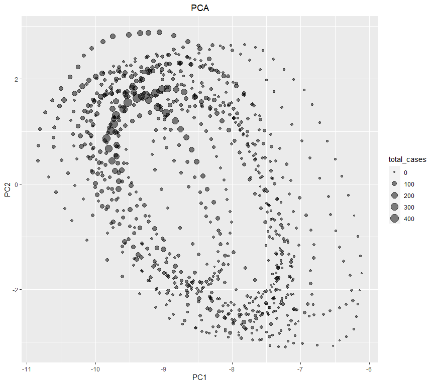
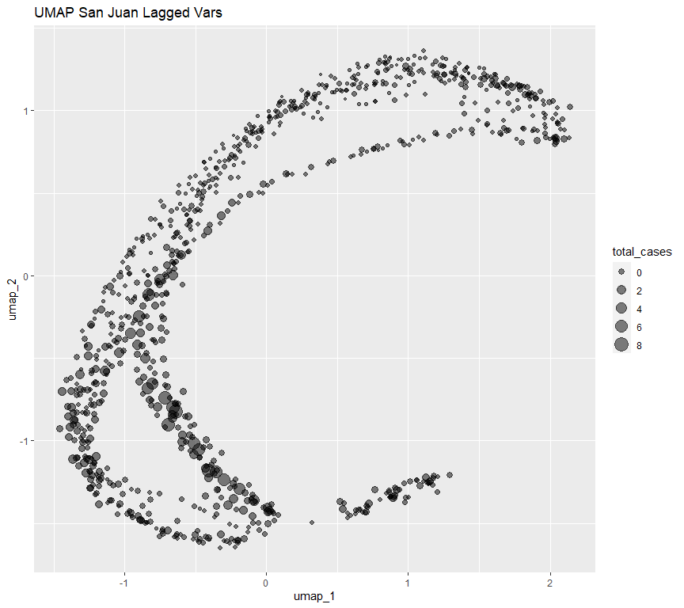
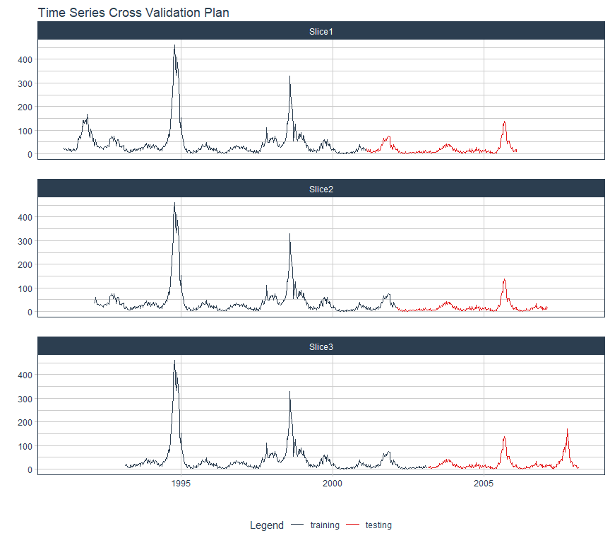
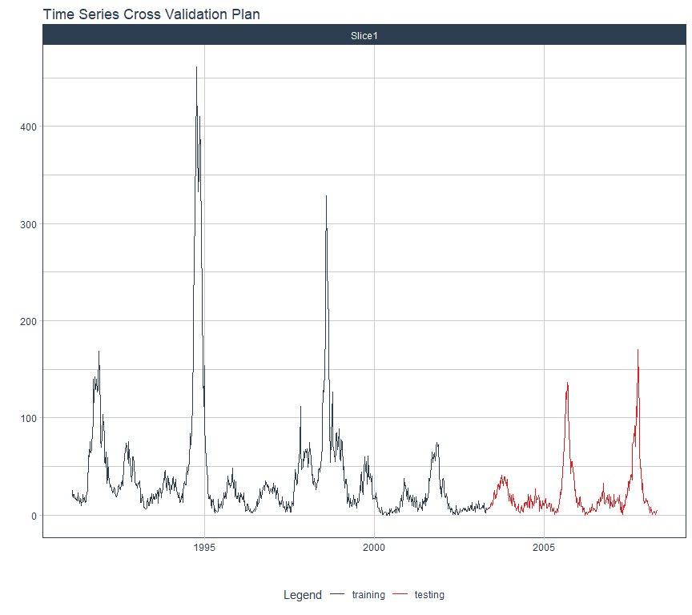
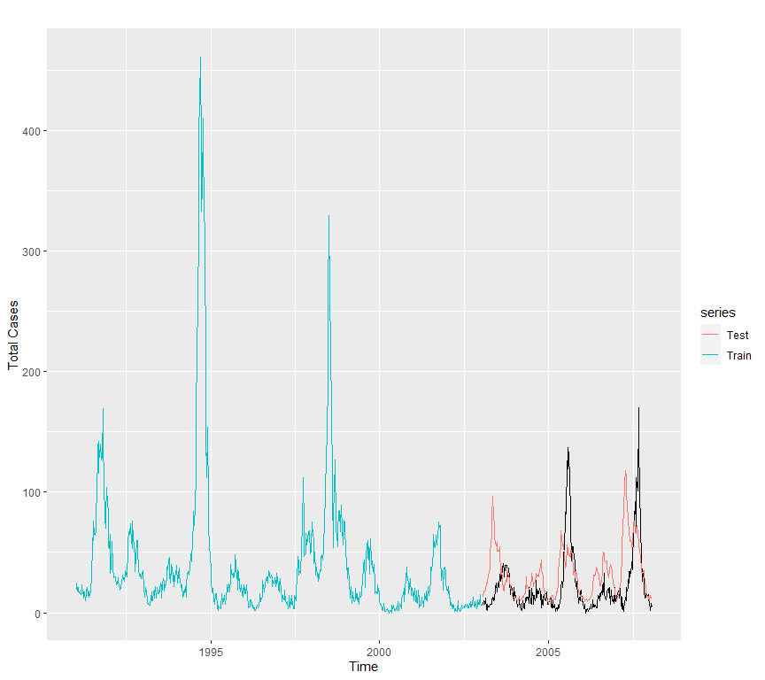
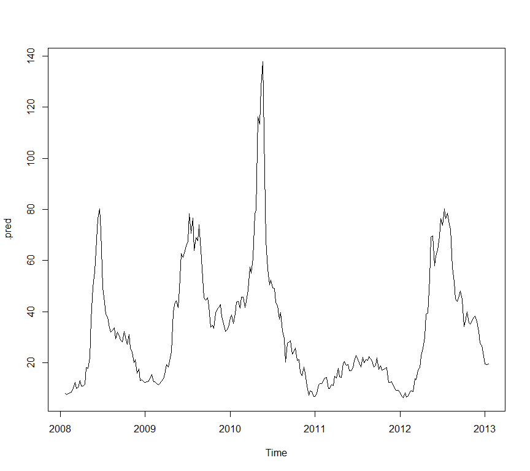
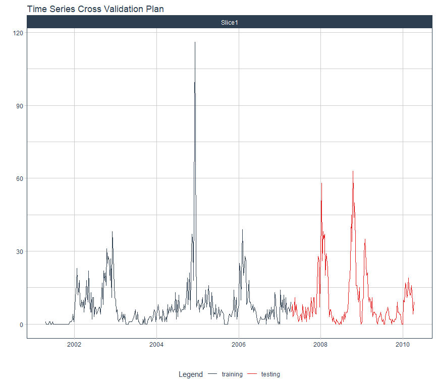
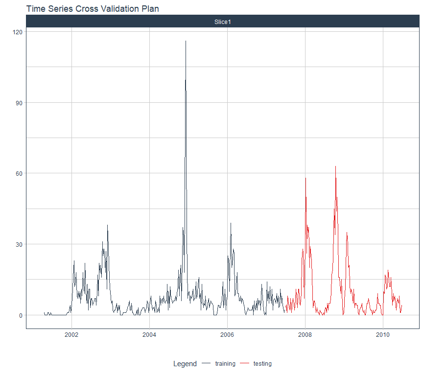
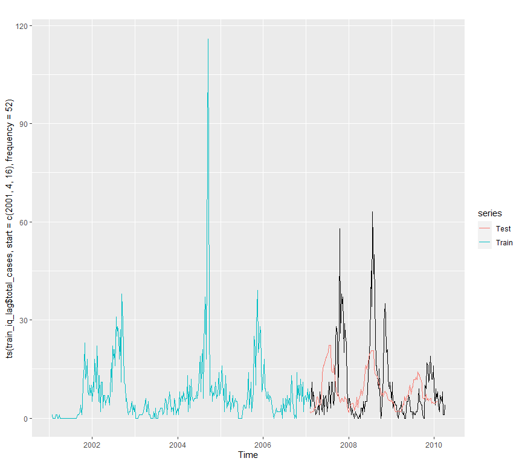
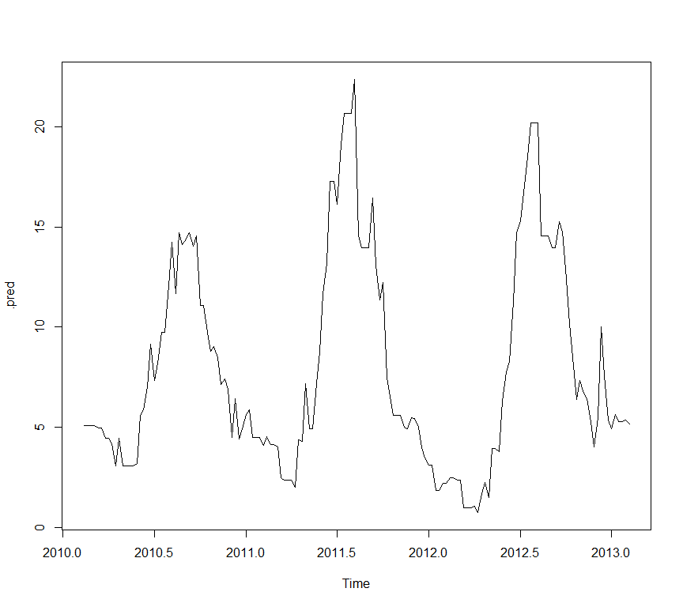

Driven Data: 21.6514 MAE.

RandomForest + Lag Variables.


# Preparation

Libraries.

R:


```r
library(dplyr)
library(data.table)
library(ggplot2)
library(inspectdf)
library(plotly)
library(glmnet)
library(tidymodels)
library(timetk)
library(forecast)
library(imputeTS)
library(reticulate)
library(modeltime)
```

Python:


```python
# import pandas as pd
# import numpy as np
# import matplotlib.pyplot as plt
# import seaborn as sns
# import ppscore as pps
```

Load Data:


```r
train_raw <- fread("data/dengue_features_train.csv",data.table = F)
train_labels <- fread("data/dengue_labels_train.csv",data.table = F)
test_raw <- fread("data/dengue_features_test.csv",data.table = F)
```

Transform **week_start_date** into date.


```r
train_raw$week_start_date <- lubridate::ymd(train_raw$week_start_date)
test_raw$week_start_date <- lubridate::ymd(test_raw$week_start_date)
```

Join Data & Train/Test


```r
train_all <- cbind(train_raw, select(train_labels, total_cases))

# Train
train_sj <- train_all %>% 
  filter(city=="sj")
train_iq <- train_all %>% 
  filter(city=="iq")

# Test
test_sj <- test_raw %>% 
  filter(city=="sj")
test_iq <- test_raw %>% 
  filter(city=="iq")
```

# Imputation of NA in San Juan


```r
# Get the variables which contain NA.
mask_na <- sapply(train_sj, function(x){
  any(is.na(x))
})
names_na <- names(train_sj)[mask_na]

# Impute NA with Kalman (Arima). It often gets better results than interpolation.
train_sj[,mask_na] <- sapply(names_na, function(x, data){
  data[,x] <- imputeTS::na_kalman(data[,x])
}, train_sj)
```

# Best Variables:

  1. Create a dataframe that matches the variables with their maximum lag from the EDA.
  2. Created lags.
  

```r
preprocess_lag_train <- function(data) {
  frame <- data.frame(
    var = c(
      "reanalysis_avg_temp_k","reanalysis_dew_point_temp_k",
      "reanalysis_max_air_temp_k","reanalysis_min_air_temp_k",
      "reanalysis_specific_humidity_g_per_kg","station_avg_temp_c",
      "station_max_temp_c","station_min_temp_c","weekofyear"
      ),
    lag = c(
      16,39,  12,21,  14,41,  37,26,3
    )
  ) # DataFrame con las variables deseadas y sus resprectivos lag de PPS.
  d = 0 # Como hay varias variables primero queremos declarar el max lag para la variable 1, luego variable 2...
  for (name in frame$var) {
    d = d+1 # Entra a la variable 1 y requerre de 1: a su lag máximo
    for (i in 1:frame$lag[d]) {
      data[,paste(name,i,sep = "")] <- lag(data[,name],i) # Va creando las nuevas variables lag de 1 a max lag
    }
  }
  data <- data[-1:-max(frame$lag),] # Eliminamos el Máximo lag global. (Porque si no habría NA)
  select(data,
    contains("reanalysis_avg_temp_k"),contains("reanalysis_dew_point_temp_k"),week_start_date,
    contains("reanalysis_max_air_temp_k"),contains("reanalysis_min_air_temp_k"),contains("week"),
    contains("station_avg_temp_c"),contains("station_max_temp_c"),contains("station_min_temp_c"),weekofyear,total_cases
  )
}
train_sj_lag <- preprocess_lag_train(train_sj)
```

Is PCA useful? 


```r
pca_recipe <- recipe(total_cases~.,data=train_sj_lag) %>% 
  step_range(all_numeric(), -all_outcomes(), min=0,max=1) %>% 
  step_pca(all_numeric(),-all_outcomes()) 

pca_recipe %>% prep() %>% juice() %>% 
  ggplot(., aes(PC1, PC2, size=total_cases)) +
    geom_point(alpha=.5) +
    labs(title = "PCA") +
    theme(plot.title = element_text(hjust = 0.5))
```

<!-- -->

UMAP?


```r
set.seed(123)
recipe_umap <- recipe(total_cases~.,data=train_sj_lag) %>% 
  step_range(all_numeric(),-all_outcomes(),min=0,max=1) %>% 
  embed::step_umap(all_numeric(),-all_outcomes(),num_comp = 3) %>% 
  step_normalize(all_numeric())

recipe_umap %>% prep %>% juice %>% 
  ggplot(., aes(umap_1,umap_2,size=total_cases)) +
  geom_point(alpha=.5) +
  labs(title="UMAP San Juan Lagged Vars")
```

<!-- -->
3D


```r
# set.seed(123)
# plot_ly(
#   data=recipe_umap %>% prep %>% juice,
#   x=~umap_1,
#   y=~umap_2,
#   z=~umap_3,
#   size=~total_cases,
#   mode="scatter3d",
#   marker = list(
#     symbol="circle",
#     sizemode="diameter",
#     sizes=c(.1,.1),
#     showscale=TRUE,
#     color = ~total_cases, colorscale = c('#FFE1A1', '#683531')
#   )
# ) 
```

# Rolling Origin:

Train with 10 years. 52*10=500
Test with 5 years. 52*5=260


```r
set.seed(123)
time_folds <- rolling_origin(data = train_sj_lag, initial = 520,skip=52, assess = 260,cumulative = F)
time_folds %>% 
  plot_time_series_cv_plan(.date_var = week_start_date, .value = total_cases, .interactive=F)
```

<!-- -->

# Random Forest

500 + min_node 3

mtry 1:7


```r
# 1.Recipe: Don't do parallel with UMAP
set.seed(123)
recipe <- recipe(total_cases~.,data=train_sj_lag) %>% 
  step_range(all_numeric(), -all_outcomes(), min=0,max=1) %>% 
  step_pca(all_numeric(),-all_outcomes()) %>% 
  step_mutate(month=lubridate::month(week_start_date)) %>% 
  step_rm(week_start_date)

# 2. Model:
model <- rand_forest(
  trees = 500,
  mtry = tune(),
  min_n = 3,
  mode = "regression"
) %>% set_engine("ranger", seed=123)

# 3. Wf
wf <- workflow() %>% 
  add_recipe(recipe) %>% 
  add_model(model)

# 4. Grid
grid <- grid_max_entropy(
  finalize(mtry(), recipe %>% prep %>% juice),
  size = 5
)

# 5. Tune
tictoc::tic()
#doParallel::registerDoParallel()
tune_model <- tune_grid(
  wf,
  resamples = time_folds,
  grid = grid,
  metrics = metric_set(mae,rmse),
  control = control_grid(save_pred = TRUE)
)
tictoc::toc()
```

```
## 12.23 sec elapsed
```

```r
# 6. Metrics:
tune_model %>% show_best(metric ="mae")
```

```
## # A tibble: 4 x 6
##    mtry .metric .estimator  mean     n std_err
##   <int> <chr>   <chr>      <dbl> <int>   <dbl>
## 1     1 mae     standard    23.9     3    2.42
## 2     3 mae     standard    25.9     3    1.86
## 3     4 mae     standard    27.0     3    1.91
## 4     6 mae     standard    29.3     3    1.67
```

```r
beepr::beep(3)
```

How Well it Predicted?


```r
splits <-  time_series_split(
  train_sj_lag,
  week_start_date,
  assess = "5 years",
  cumulative = T
)
splits %>% 
  timetk::tk_time_series_cv_plan() %>% 
  plot_time_series_cv_plan(.date_var = week_start_date,.value = total_cases, .interactive=F)
```

<!-- -->

```r
training <- training(splits)
testing <- testing(splits)
```
To construct time series:


```r
min(training$week_start_date)
```

```
## [1] "1991-02-12"
```

```r
max(training$week_start_date)
```

```
## [1] "2003-04-23"
```

```r
min(testing$week_start_date)
```

```
## [1] "2003-04-30"
```

```r
max(testing$week_start_date)
```

```
## [1] "2008-04-22"
```

Fit with training.


```r
wf_f <- finalize_workflow(wf, select_best(tune_model, metric = "mae")) %>% fit(training)

ts_complete <- ts(
  train_sj_lag$total_cases, 
  start=c(1991,2,12), end = c(2008,4,22),
  frequency=52
)

ts_train <- ts(
  training(splits)$total_cases, 
  start = c(1991,2,12), end = c(2003,4,23), 
  frequency = 52
)

ts_test <- ts(
  predict(
    wf_f,
    testing(splits)
  ), 
  start=c(2003,4,30), 
  frequency = 52
)

autoplot(ts_complete) +
  autolayer(ts_train, series="Train") + 
  autolayer(ts_test, series="Test") +
  labs(y="Total Cases")
```

<!-- -->
# Lag to test

Apply the same trearment to test.


```r
preprocess_lag_test <- function(train,test) {
  # Train no lagged.
  frame <- data.frame(
    var = c(
      "reanalysis_avg_temp_k","reanalysis_dew_point_temp_k",
      "reanalysis_max_air_temp_k","reanalysis_min_air_temp_k",
      "reanalysis_specific_humidity_g_per_kg","station_avg_temp_c",
      "station_max_temp_c","station_min_temp_c","weekofyear"
      ),
    lag = c(
      16,39,  12,21,  14,41,  37,26,3
    )
  )
  d = 0
  for (name in frame$var) {
    d = d+1
    for (i in 1:frame$lag[d]) {
      test[,paste(name,i,sep = "")] <- lag(test[,name],i)
      test[,paste(name,i,sep = "")][1:i] <- train[,name][nrow(train)-i+1:nrow(train)] # or tail(,i)
    }
  }
  
  test
}
test_sj_lag <- preprocess_lag_test(train_sj,test_sj)
```


Remove NA in test.


```r
# Get the variables which contain NA.
mask_na <- sapply(test_sj_lag, function(x){
  any(is.na(x))
})
names_na <- names(test_sj_lag)[mask_na]

# Impute NA with Kalman (Arima). It often gets better results than interpolation.
test_sj_lag[,mask_na] <- sapply(names_na, function(x, data){
  data[,x] <- imputeTS::na_kalman(data[,x])
}, test_sj_lag)
```


# Predictions:


```r
wf_f <- finalize_workflow(wf, select_best(tune_model, metric = "mae")) %>% fit(train_sj_lag) # Fit Whole data set.
predict(wf_f, test_sj_lag) %>% ts(frequency = 52, start = c(2008,4,29)) %>% plot
```

<!-- -->

```r
pred <- predict(wf_f, test_sj_lag)
```
# Submision:


```r
# sub <- read.csv("sublag3.csv")
# sub$total_cases[sub$city=="sj"] <- pred$.pred %>% round
# write.csv(sub,"sublag6.csv",row.names = F)
```

-------------------------------

**IQUITOS**

Preprocess train.

NA


```r
# Get the variables which contain NA.
mask_na <- sapply(train_iq, function(x){
  any(is.na(x))
})
names_na <- names(train_iq)[mask_na]

# Impute NA with Kalman (Arima). It often gets better results than interpolation.
train_iq[,mask_na] <- sapply(names_na, function(x, data){
  data[,x] <- imputeTS::na_kalman(data[,x])
}, train_iq)
```


Treatments.


```r
preprocess_lag_train <- function(data) {
  frame <- data.frame(
    var = c(
      "reanalysis_avg_temp_k","reanalysis_dew_point_temp_k",
      "reanalysis_max_air_temp_k","reanalysis_min_air_temp_k",
      "reanalysis_specific_humidity_g_per_kg","station_avg_temp_c",
      "station_max_temp_c","station_min_temp_c","weekofyear"
      ),
    lag = c(
      4,6,  41,40,  26,40,  39,25,3
    )
  )
  d = 0
  for (name in frame$var) {
    d = d+1
    for (i in 1:frame$lag[d]) {
      data[,paste(name,i,sep = "")] <- lag(data[,name],i)
    }
  }
  data <- data[-1:-max(frame$lag),]
  select(data,
    contains("reanalysis_avg_temp_k"),contains("reanalysis_dew_point_temp_k"),week_start_date,
    contains("reanalysis_max_air_temp_k"),contains("reanalysis_min_air_temp_k"),contains("week"),
    contains("station_avg_temp_c"),contains("station_max_temp_c"),contains("station_min_temp_c"),weekofyear,total_cases
  )
}
train_iq_lag <- preprocess_lag_train(train_iq)
```


# Rolling Origin:

  * Train: From 2000/07/01 to 2010/06/25. 10 years.
  * Test: From 2010/07/02 to 2013/06/25. 3 years.

Train with 6 years. 52*6=312.
Test with 3 years. 52*3=156.


```r
set.seed(123)
time_folds <- rolling_origin(data = train_iq_lag, initial = 312,skip=52, assess = 156,cumulative = F)
time_folds %>% 
  plot_time_series_cv_plan(.date_var = week_start_date, .value = total_cases, .interactive=F)
```

<!-- -->

# Random Forest


```r
# 1.Recipe: Don't do parallel with UMAP
set.seed(123)
recipe <- recipe(total_cases~.,data=train_iq_lag) %>% 
  step_range(all_numeric(), -all_outcomes(), min=0,max=1) %>% 
  step_pca(all_numeric(),-all_outcomes()) %>% 
  step_mutate(month=lubridate::month(week_start_date)) %>% 
  step_rm(week_start_date)

# 2. Model:
model <- rand_forest(
  trees = tune(),
  mtry = tune(),
  min_n = tune(),
  mode = "regression"
) %>% set_engine("ranger", seed=123)

# 3. Wf
wf <- workflow() %>% 
  add_recipe(recipe) %>% 
  add_model(model)

# 4. Grid
grid <- grid_max_entropy(
  finalize(mtry(),recipe %>% prep %>% juice),
  trees(range(1,1000)),
  min_n(),
  size=100
)

# 5. Tune
tictoc::tic()
#doParallel::registerDoParallel()
tune_model <- tune_grid(
  wf,
  resamples = time_folds,
  grid = grid,
  metrics = metric_set(mae,rmse),
  control = control_grid(save_pred = TRUE)
)
tictoc::toc()
```

```
## 48.69 sec elapsed
```

```r
# 6. Metrics:
tune_model %>% show_best(metric ="mae")
```

```
## # A tibble: 5 x 8
##    mtry trees min_n .metric .estimator  mean     n std_err
##   <int> <int> <int> <chr>   <chr>      <dbl> <int>   <dbl>
## 1     3     9    39 mae     standard    6.68     1      NA
## 2     2   905    34 mae     standard    6.78     1      NA
## 3     2   834    32 mae     standard    6.78     1      NA
## 4     2   453    34 mae     standard    6.79     1      NA
## 5     3   856    39 mae     standard    6.81     1      NA
```

```r
beepr::beep(3)
```

How Well it Predicted?


```r
splits <-  time_series_split(
  train_iq_lag,
  week_start_date,
  assess = "3 years",
  cumulative = T
)
splits %>% 
  timetk::tk_time_series_cv_plan() %>% 
  plot_time_series_cv_plan(.date_var = week_start_date,.value = total_cases, .interactive=F)
```

<!-- -->

```r
training <- training(splits)
testing <- testing(splits)
```
To construct time series:


```r
min(training$week_start_date)
```

```
## [1] "2001-04-16"
```

```r
max(training$week_start_date)
```

```
## [1] "2007-06-25"
```

```r
min(testing$week_start_date)
```

```
## [1] "2007-07-02"
```

```r
max(testing$week_start_date)
```

```
## [1] "2010-06-25"
```

Fit with training.


```r
wf_f <- finalize_workflow(wf, select_best(tune_model, metric = "mae")) %>% fit(training)

autoplot(ts(train_iq_lag$total_cases,start=c(2001,4,16),frequency=52)) +
  autolayer(ts(training(splits)$total_cases, start = c(2001,4,16), end = c(2007,6,25), frequency = 52), series="Train") + 
  autolayer(ts(predict(wf_f,testing(splits)), start=c(2007,6,25), frequency = 52), series="Test")
```

<!-- -->
# Lag to test

21.95

Apply the same trearment to test.


```r
preprocess_lag_test <- function(train,test) {
  # Train no lagged.
  frame <- data.frame(
    var = c(
      "reanalysis_avg_temp_k","reanalysis_dew_point_temp_k",
      "reanalysis_max_air_temp_k","reanalysis_min_air_temp_k",
      "reanalysis_specific_humidity_g_per_kg","station_avg_temp_c",
      "station_max_temp_c","station_min_temp_c","weekofyear"
      ),
    lag = c(
       4,6,  41,40,  26,40,  39,25,3
    )
  )
  d = 0
  for (name in frame$var) {
    d = d+1
    for (i in 1:frame$lag[d]) {
      test[,paste(name,i,sep = "")] <- lag(test[,name],i)
      test[,paste(name,i,sep = "")][1:i] <- train[,name][nrow(train)-i+1:nrow(train)] # or tail(,i)
    }
  }
  
  test
}
test_iq_lag <- preprocess_lag_test(train_iq,test_iq)
```

Remove NA in test.


```r
# Get the variables which contain NA.
mask_na <- sapply(test_iq_lag, function(x){
  any(is.na(x))
})
names_na <- names(test_iq_lag)[mask_na]

# Impute NA with Kalman (Arima). It often gets better results than interpolation.
test_iq_lag[,mask_na] <- sapply(names_na, function(x, data){
  data[,x] <- imputeTS::na_kalman(data[,x])
}, test_iq_lag)
```

# Predictions:


```r
wf_f <- finalize_workflow(wf, select_best(tune_model, metric = "mae")) %>% fit(training) # Da mejor en training.
predict(wf_f, test_iq_lag) %>% ts(frequency = 52, start = c(2010,7,2)) %>% plot
```

<!-- -->

```r
pred <- predict(wf_f, test_iq_lag)
```

Submission:


```r
# sub <- read.csv("sublag5.csv")
# sub$total_cases[sub$city=="iq"] <- pred$.pred %>% round
# write.csv(sub,"sublag6.csv",row.names = F)
```


