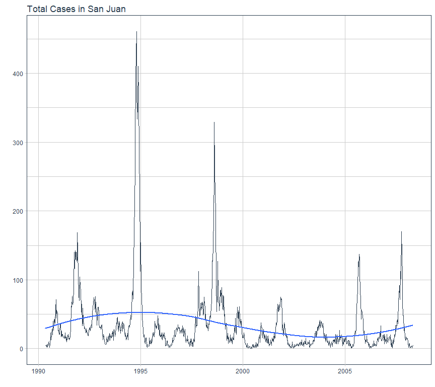

# Problem Description:

City and date indicators

    city – City abbreviations: sj for San Juan and iq for Iquitos (Perú).
    week_start_date – Date given in yyyy-mm-dd format

NOAA's GHCN daily climate data weather station measurements

    station_max_temp_c – Maximum temperature
    station_min_temp_c – Minimum temperature
    station_avg_temp_c – Average temperature
    station_precip_mm – Total precipitation
    station_diur_temp_rng_c – Diurnal temperature range

PERSIANN satellite precipitation measurements (0.25x0.25 degree scale)

    precipitation_amt_mm – Total precipitation

NOAA's NCEP Climate Forecast System Reanalysis measurements (0.5x0.5 degree scale)

    reanalysis_sat_precip_amt_mm – Total precipitation
    reanalysis_dew_point_temp_k – Mean dew point temperature
    reanalysis_air_temp_k – Mean air temperature
    reanalysis_relative_humidity_percent – Mean relative humidity
    reanalysis_specific_humidity_g_per_kg – Mean specific humidity
    reanalysis_precip_amt_kg_per_m2 – Total precipitation
    reanalysis_max_air_temp_k – Maximum air temperature
    reanalysis_min_air_temp_k – Minimum air temperature
    reanalysis_avg_temp_k – Average air temperature
    reanalysis_tdtr_k – Diurnal temperature range

Satellite vegetation - Normalized difference vegetation index (NDVI) - NOAA's CDR Normalized Difference Vegetation Index (0.5x0.5 degree scale) measurements

    ndvi_se – Pixel southeast of city centroid
    ndvi_sw – Pixel southwest of city centroid
    ndvi_ne – Pixel northeast of city centroid
    ndvi_nw – Pixel northwest of city centroid

# Preparation:

Libraries:

R:


```r
library(dplyr)
library(data.table)
library(ggplot2)
library(inspectdf)
library(plotly)
library(glmnet)
library(tidymodels)
library(timetk)
library(forecast)
library(imputeTS)
library(reticulate)
```


Python:

Se está usando el entorno base de python anaconda.


```python
import pandas as pd
import numpy as np
import matplotlib.pyplot as plt
import seaborn as sns
import ppscore as pps
```


Load Data:


```r
train_raw <- fread("data/dengue_features_train.csv",data.table = F)
train_labels <- fread("data/dengue_labels_train.csv",data.table = F)
test_raw <- fread("data/dengue_features_test.csv",data.table = F)
```


Convert the date variable into class "date".


```r
train_raw$week_start_date <- lubridate::ymd(train_raw$week_start_date)
test_raw$week_start_date <- lubridate::ymd(test_raw$week_start_date)
```


Join Data & Train/Test


```r
train_all <- cbind(train_raw, select(train_labels, total_cases))

# Train
train_sj <- train_all %>% 
  filter(city=="sj")
train_iq <- train_all %>% 
  filter(city=="iq")

# Test
test_sj <- test_raw %>% 
  filter(city=="sj")
test_iq <- test_raw %>% 
  filter(city=="iq")
```


# Dates for San Juan & Iquitos

San Juan:

  * Train: From 1990/04/30 to 2008/04/22. 18 years.
  * Test: From 2008/04/29 to 2014/04/23. 5 years.


```r
# Train
train_sj$week_start_date %>% min()
```

```
## [1] "1990-04-30"
```

```r
train_sj$week_start_date %>% max()
```

```
## [1] "2008-04-22"
```

```r
# Test
test_sj$week_start_date %>% min()
```

```
## [1] "2008-04-29"
```

```r
test_sj$week_start_date %>% max()
```

```
## [1] "2013-04-23"
```


Iquitos:

  * Train: From 2000/07/01 to 2010/06/25. 10 years.
  * Test: From 2010/07/02 to 2013/06/25. 3 years.


```r
# Train
train_iq$week_start_date %>% min()
```

```
## [1] "2000-07-01"
```

```r
train_iq$week_start_date %>% max()
```

```
## [1] "2010-06-25"
```

```r
# Test
test_iq$week_start_date %>% min()
```

```
## [1] "2010-07-02"
```

```r
test_iq$week_start_date %>% max()
```

```
## [1] "2013-06-25"
```


How many observations by city?

  * San Joan 936.
  * Iquitos 520.


```r
train_all %>% 
  group_by(city) %>% 
  summarise(n(), .groups = 'drop') 
```

```
## # A tibble: 2 x 2
##   city  `n()`
##   <chr> <int>
## 1 iq      520
## 2 sj      936
```

# Stats


San Juan:

  * ndvi_ne has 191 missing values: 20%.


```r
skimr::skim(train_sj)
```


Table: Data summary

|                         |         |
|:------------------------|:--------|
|Name                     |train_sj |
|Number of rows           |936      |
|Number of columns        |25       |
|_______________________  |         |
|Column type frequency:   |         |
|character                |1        |
|Date                     |1        |
|numeric                  |23       |
|________________________ |         |
|Group variables          |None     |


**Variable type: character**

|skim_variable | n_missing| complete_rate| min| max| empty| n_unique| whitespace|
|:-------------|---------:|-------------:|---:|---:|-----:|--------:|----------:|
|city          |         0|             1|   2|   2|     0|        1|          0|


**Variable type: Date**

|skim_variable   | n_missing| complete_rate|min        |max        |median     | n_unique|
|:---------------|---------:|-------------:|:----------|:----------|:----------|--------:|
|week_start_date |         0|             1|1990-04-30 |2008-04-22 |1999-04-26 |      936|


**Variable type: numeric**

|skim_variable                         | n_missing| complete_rate|    mean|    sd|      p0|     p25|     p50|     p75|    p100|hist                                     |
|:-------------------------------------|---------:|-------------:|-------:|-----:|-------:|-------:|-------:|-------:|-------:|:----------------------------------------|
|year                                  |         0|          1.00| 1998.83|  5.21| 1990.00| 1994.00| 1999.00| 2003.00| 2008.00|▇▇▆▇▆ |
|weekofyear                            |         0|          1.00|   26.50| 15.02|    1.00|   13.75|   26.50|   39.25|   53.00|▇▇▇▇▇ |
|ndvi_ne                               |       191|          0.80|    0.06|  0.11|   -0.41|    0.00|    0.06|    0.11|    0.49|▁▂▇▂▁ |
|ndvi_nw                               |        49|          0.95|    0.07|  0.09|   -0.46|    0.02|    0.07|    0.12|    0.44|▁▁▇▆▁ |
|ndvi_se                               |        19|          0.98|    0.18|  0.06|   -0.02|    0.14|    0.18|    0.21|    0.39|▁▅▇▂▁ |
|ndvi_sw                               |        19|          0.98|    0.17|  0.06|   -0.06|    0.13|    0.17|    0.20|    0.38|▁▂▇▃▁ |
|precipitation_amt_mm                  |         9|          0.99|   35.47| 44.61|    0.00|    0.00|   20.80|   52.18|  390.60|▇▁▁▁▁ |
|reanalysis_air_temp_k                 |         6|          0.99|  299.16|  1.24|  295.94|  298.19|  299.25|  300.13|  302.20|▁▆▇▇▂ |
|reanalysis_avg_temp_k                 |         6|          0.99|  299.28|  1.22|  296.11|  298.30|  299.38|  300.23|  302.16|▁▆▆▇▂ |
|reanalysis_dew_point_temp_k           |         6|          0.99|  295.11|  1.57|  289.64|  293.85|  295.46|  296.42|  297.80|▁▂▆▇▇ |
|reanalysis_max_air_temp_k             |         6|          0.99|  301.40|  1.26|  297.80|  300.40|  301.50|  302.40|  304.30|▁▅▇▇▂ |
|reanalysis_min_air_temp_k             |         6|          0.99|  297.30|  1.29|  292.60|  296.30|  297.50|  298.40|  299.90|▁▂▆▇▅ |
|reanalysis_precip_amt_kg_per_m2       |         6|          0.99|   30.47| 35.63|    0.00|   10.83|   21.30|   37.00|  570.50|▇▁▁▁▁ |
|reanalysis_relative_humidity_percent  |         6|          0.99|   78.57|  3.39|   66.74|   76.25|   78.67|   80.96|   87.58|▁▃▇▇▂ |
|reanalysis_sat_precip_amt_mm          |         9|          0.99|   35.47| 44.61|    0.00|    0.00|   20.80|   52.18|  390.60|▇▁▁▁▁ |
|reanalysis_specific_humidity_g_per_kg |         6|          0.99|   16.55|  1.56|   11.72|   15.24|   16.85|   17.86|   19.44|▁▃▆▇▆ |
|reanalysis_tdtr_k                     |         6|          0.99|    2.52|  0.50|    1.36|    2.16|    2.46|    2.80|    4.43|▂▇▅▂▁ |
|station_avg_temp_c                    |         6|          0.99|   27.01|  1.42|   22.84|   25.84|   27.23|   28.19|   30.07|▁▅▅▇▂ |
|station_diur_temp_rng_c               |         6|          0.99|    6.76|  0.84|    4.53|    6.20|    6.76|    7.29|    9.91|▂▇▇▂▁ |
|station_max_temp_c                    |         6|          0.99|   31.61|  1.72|   26.70|   30.60|   31.70|   32.80|   35.60|▁▃▆▇▂ |
|station_min_temp_c                    |         6|          0.99|   22.60|  1.51|   17.80|   21.70|   22.80|   23.90|   25.60|▁▂▆▇▃ |
|station_precip_mm                     |         6|          0.99|   26.79| 29.33|    0.00|    6.82|   17.75|   35.45|  305.90|▇▁▁▁▁ |
|total_cases                           |         0|          1.00|   34.18| 51.38|    0.00|    9.00|   19.00|   37.00|  461.00|▇▁▁▁▁ |
  
 
Iquitos:
  

```r
skimr::skim(train_iq)
```


Table: Data summary

|                         |         |
|:------------------------|:--------|
|Name                     |train_iq |
|Number of rows           |520      |
|Number of columns        |25       |
|_______________________  |         |
|Column type frequency:   |         |
|character                |1        |
|Date                     |1        |
|numeric                  |23       |
|________________________ |         |
|Group variables          |None     |


**Variable type: character**

|skim_variable | n_missing| complete_rate| min| max| empty| n_unique| whitespace|
|:-------------|---------:|-------------:|---:|---:|-----:|--------:|----------:|
|city          |         0|             1|   2|   2|     0|        1|          0|


**Variable type: Date**

|skim_variable   | n_missing| complete_rate|min        |max        |median     | n_unique|
|:---------------|---------:|-------------:|:----------|:----------|:----------|--------:|
|week_start_date |         0|             1|2000-07-01 |2010-06-25 |2005-06-28 |      520|


**Variable type: numeric**

|skim_variable                         | n_missing| complete_rate|    mean|    sd|      p0|     p25|     p50|     p75|    p100|hist                                     |
|:-------------------------------------|---------:|-------------:|-------:|-----:|-------:|-------:|-------:|-------:|-------:|:----------------------------------------|
|year                                  |         0|          1.00| 2005.00|  2.92| 2000.00| 2002.75| 2005.00| 2007.25| 2010.00|▇▆▆▆▅ |
|weekofyear                            |         0|          1.00|   26.50| 15.03|    1.00|   13.75|   26.50|   39.25|   53.00|▇▇▇▇▇ |
|ndvi_ne                               |         3|          0.99|    0.26|  0.08|    0.06|    0.20|    0.26|    0.32|    0.51|▂▇▇▃▁ |
|ndvi_nw                               |         3|          0.99|    0.24|  0.08|    0.04|    0.18|    0.23|    0.29|    0.45|▁▇▇▅▁ |
|ndvi_se                               |         3|          0.99|    0.25|  0.08|    0.03|    0.19|    0.25|    0.30|    0.54|▁▇▇▂▁ |
|ndvi_sw                               |         3|          0.99|    0.27|  0.09|    0.06|    0.20|    0.26|    0.33|    0.55|▂▇▇▃▁ |
|precipitation_amt_mm                  |         4|          0.99|   64.25| 35.22|    0.00|   39.11|   60.47|   85.76|  210.83|▅▇▃▁▁ |
|reanalysis_air_temp_k                 |         4|          0.99|  297.87|  1.17|  294.64|  297.09|  297.82|  298.65|  301.64|▁▆▇▃▁ |
|reanalysis_avg_temp_k                 |         4|          0.99|  299.13|  1.33|  294.89|  298.22|  299.12|  300.12|  302.93|▁▃▇▆▁ |
|reanalysis_dew_point_temp_k           |         4|          0.99|  295.49|  1.42|  290.09|  294.59|  295.85|  296.55|  298.45|▁▁▃▇▂ |
|reanalysis_max_air_temp_k             |         4|          0.99|  307.08|  2.38|  300.00|  305.20|  307.05|  308.70|  314.00|▁▆▇▆▁ |
|reanalysis_min_air_temp_k             |         4|          0.99|  292.87|  1.66|  286.90|  291.98|  293.05|  294.20|  296.00|▁▁▅▇▅ |
|reanalysis_precip_amt_kg_per_m2       |         4|          0.99|   57.61| 50.29|    0.00|   24.07|   46.44|   71.07|  362.03|▇▂▁▁▁ |
|reanalysis_relative_humidity_percent  |         4|          0.99|   88.64|  7.58|   57.79|   84.29|   90.92|   94.56|   98.61|▁▁▂▅▇ |
|reanalysis_sat_precip_amt_mm          |         4|          0.99|   64.25| 35.22|    0.00|   39.11|   60.47|   85.76|  210.83|▅▇▃▁▁ |
|reanalysis_specific_humidity_g_per_kg |         4|          0.99|   17.10|  1.45|   12.11|   16.10|   17.43|   18.18|   20.46|▁▂▅▇▁ |
|reanalysis_tdtr_k                     |         4|          0.99|    9.21|  2.45|    3.71|    7.37|    8.96|   11.01|   16.03|▂▇▇▅▁ |
|station_avg_temp_c                    |        37|          0.93|   27.53|  0.92|   21.40|   27.00|   27.60|   28.10|   30.80|▁▁▃▇▁ |
|station_diur_temp_rng_c               |        37|          0.93|   10.57|  1.54|    5.20|    9.50|   10.62|   11.66|   15.80|▁▃▇▅▁ |
|station_max_temp_c                    |        14|          0.97|   34.00|  1.33|   30.10|   33.20|   34.00|   34.90|   42.20|▂▇▃▁▁ |
|station_min_temp_c                    |         8|          0.98|   21.20|  1.26|   14.70|   20.60|   21.30|   22.00|   24.20|▁▁▂▇▃ |
|station_precip_mm                     |        16|          0.97|   62.47| 63.25|    0.00|   17.20|   45.30|   85.95|  543.30|▇▁▁▁▁ |
|total_cases                           |         0|          1.00|    7.57| 10.77|    0.00|    1.00|    5.00|    9.00|  116.00|▇▁▁▁▁ |


# EDA Graphic


Quick EDA: San Juan.

  * Variables referred to precipitation have skewed distributions.
  * Response variable shows a negative binomial distribution.
  * reanalysis_sat_precip_amt_mm vs	precipitation_amt_mm	1 correlation. (Same variable).
  * In general there is not much correlation with the objective variable. We may check the correlation with the "lagged" variables.


```r
# Histograms for numeric columns
x <- inspect_num(train_sj)
show_plot(x)
```

<!-- -->

```r
# Occurence of NAs in each column ranked in descending order
x <- inspect_na(train_sj)
show_plot(x)
```

<!-- -->

```r
# Correlation betwee numeric columns + confidence intervals
x <- inspect_cor(train_sj)
x %>% head()
```

```
## # A tibble: 6 x 7
##   col_1                   col_2              corr   p_value lower upper pcnt_nna
##   <chr>                   <chr>             <dbl>     <dbl> <dbl> <dbl>    <dbl>
## 1 reanalysis_sat_precip_~ precipitation_am~ 1     5.95e-203 1     1         99.0
## 2 reanalysis_specific_hu~ reanalysis_dew_p~ 0.999 5.17e-203 0.998 0.999     99.4
## 3 reanalysis_avg_temp_k   reanalysis_air_t~ 0.997 1.35e-202 0.997 0.998     99.4
## 4 reanalysis_min_air_tem~ reanalysis_air_t~ 0.942 5.31e-181 0.935 0.949     99.4
## 5 reanalysis_min_air_tem~ reanalysis_avg_t~ 0.939 8.19e-180 0.931 0.946     99.4
## 6 reanalysis_max_air_tem~ reanalysis_avg_t~ 0.939 9.49e-180 0.931 0.946     99.4
```

```r
# Only Target Variable:
x %>% 
  filter(col_1=="total_cases" | col_2=="total_cases") %>% head()
```

```
## # A tibble: 6 x 7
##   col_1      col_2                          corr  p_value  lower  upper pcnt_nna
##   <chr>      <chr>                         <dbl>    <dbl>  <dbl>  <dbl>    <dbl>
## 1 total_cas~ weekofyear                    0.287 1.78e-18  0.227  0.345    100  
## 2 total_cas~ year                         -0.213 8.21e-11 -0.273 -0.151    100  
## 3 total_cas~ reanalysis_specific_humidit~  0.208 2.43e-10  0.146  0.269     99.4
## 4 total_cas~ reanalysis_dew_point_temp_k   0.204 5.50e-10  0.141  0.265     99.4
## 5 total_cas~ station_avg_temp_c            0.197 2.15e- 9  0.134  0.258     99.4
## 6 total_cas~ reanalysis_max_air_temp_k     0.195 3.16e- 9  0.132  0.256     99.4
```


Quick EDA: Iquitos.

  * It's a rainier city than San Juan.
  * reanalysis_sat_precip_amt_mm vs	precipitation_amt_mm	1.
  * reanalysis_specific_humidity_g_per_kg vs	reanalysis_dew_point_temp_k	0.997.
  * reanalysis_avg_temp_k	vs reanalysis_air_temp_k	0.973.


```r
# Histograms for numeric columns
x <- inspect_num(train_iq)
show_plot(x)
```

<!-- -->

```r
# Occurence of NAs in each column ranked in descending order
x <- inspect_na(train_iq)
show_plot(x)
```

<!-- -->

```r
# Correlation between numeric columns + confidence intervals
x <- inspect_cor(train_iq)
x %>% head()
```

```
## # A tibble: 6 x 7
##   col_1               col_2                corr   p_value  lower  upper pcnt_nna
##   <chr>               <chr>               <dbl>     <dbl>  <dbl>  <dbl>    <dbl>
## 1 reanalysis_sat_pre~ precipitation_amt~  1     1.41e-113  1      1         99.2
## 2 reanalysis_specifi~ reanalysis_dew_po~  0.998 4.42e-113  0.997  0.998     99.2
## 3 reanalysis_avg_tem~ reanalysis_air_te~  0.973 1.06e-107  0.968  0.978     99.2
## 4 reanalysis_tdtr_k   reanalysis_relati~ -0.896 1.16e- 91 -0.912 -0.878     99.2
## 5 ndvi_sw             ndvi_ne             0.843 2.20e- 81  0.816  0.866     99.4
## 6 reanalysis_tdtr_k   reanalysis_max_ai~  0.799 2.99e- 73  0.766  0.828     99.2
```

```r
# Only Target:
x %>% 
  filter(col_1=="total_cases" | col_2=="total_cases") %>% head()
```

```
## # A tibble: 6 x 7
##   col_1     col_2                       corr    p_value   lower   upper pcnt_nna
##   <chr>     <chr>                      <dbl>      <dbl>   <dbl>   <dbl>    <dbl>
## 1 total_ca~ reanalysis_specific_humi~  0.236    8.51e-8  0.153   0.316      99.2
## 2 total_ca~ reanalysis_dew_point_tem~  0.230    1.80e-7  0.147   0.311      99.2
## 3 total_ca~ reanalysis_min_air_temp_k  0.215    1.18e-6  0.131   0.295      99.2
## 4 total_ca~ station_min_temp_c         0.212    1.79e-6  0.127   0.293      98.5
## 5 total_ca~ year                       0.179    4.50e-5  0.0949  0.261     100  
## 6 total_ca~ reanalysis_tdtr_k         -0.134    2.33e-3 -0.218  -0.0487     99.2
```


# Time Series


**San Juan:**

1. Time Serie:


```r
train_sj %>% 
  mutate(week_start_date=lubridate::ymd(week_start_date)) %>% 
  plot_time_series(
    .date=week_start_date,
    .value=total_cases,
    .title="Total Cases in San Juan",
    .interactive=FALSE
  )
```

<!-- -->


2. Seasonality:


```r
train_sj %>% 
  mutate(week_start_date=lubridate::ymd(week_start_date)) %>% 
  plot_seasonal_diagnostics(
    .date=week_start_date,
    .value=total_cases,
    .title="Seasonality in San Juan",
    .interactive=FALSE
  )
```

<!-- -->


3. All Series:


```r
series <- select(train_sj, -city:-week_start_date, -total_cases) %>% names()
all_series <- function(data, series, date_var) {
  # vars: vector with the variables' names excluding date_var!!! as char
  # date_var: the name of date_var as char
  for (i in 1:length(series)) {
    vec <- c(date_var, series[i])
    print(data[,vec] %>% 
      set_names(c("date", "value")) %>% 
      plot_time_series(
        .date=date,
        .value=value,
        .title=series[i],
        .interactive=FALSE
      ))
  }
}
all_series(train_sj,series,"week_start_date")
```

<!-- --><!-- --><!-- --><!-- --><!-- --><!-- --><!-- --><!-- --><!-- --><!-- --><!-- --><!-- --><!-- --><!-- --><!-- --><!-- --><!-- --><!-- --><!-- --><!-- -->

**Iquitos:**


```r
train_iq %>% 
  plot_time_series(
    .date=week_start_date,
    .value=total_cases,
    .title="Total Cases Iquitos",
    .interactive=FALSE
  )
```

<!-- -->

2. Seasonality:


```r
train_iq %>% 
  plot_seasonal_diagnostics(
    .date=week_start_date,
    .value=total_cases,
    .title="Seasonality in San Juan",
    .interactive=FALSE
  )
```

<!-- -->

**ALl Series**


```r
series <- select(train_iq, -city:-week_start_date, -total_cases) %>% names()
all_series(train_iq,series,"week_start_date")
```

<!-- --><!-- --><!-- --><!-- --><!-- --><!-- --><!-- --><!-- --><!-- --><!-- --><!-- --><!-- --><!-- --><!-- --><!-- --><!-- --><!-- --><!-- --><!-- --><!-- -->

# Lagged variables correlaiton

When thinking about time series we may want to predict the future with what has happened in the past. The humidity 2 weeks ago can affect in the mosquito breeding today. Eventually we may to explore those past patterns to explain total cases.

San Juan:

A) Impute NA with KALMAN.


```r
# Get the variables which contain NA.
mask_na <- sapply(train_sj, function(x){
  any(is.na(x))
})
names_na <- names(train_sj)[mask_na]

# Impute NA with Kalman (Arima). It often gets better results than interpolation.
train_sj[,mask_na] <- sapply(names_na, function(x, data){
  data[,x] <- imputeTS::na_kalman(data[,x])
}, train_sj)
```


B) Create a Model with lag variables.

- NNAR (When we have <100 observations).


```r
# ts_corr <- function(data, predictors, response, freq, max_lag) {
#   # data: dataframe.
#   # predictors: char vector with the predictors.
#   # response: char value with the response var.
#   # freq: frequency of the time series (52 weekly, 12 monthly...)
#   # max_lag: t-lag
#   require(forecast)
#   r2 <- data.frame(lag=1:max_lag) # Empty data.frame
#   l <- length(predictors)
#   for (name in predictors) {
#     ts <- ts(rev(data[,name][832:936]),frequency = freq) 
#     # rev because NAs are introduced when lagging the serie.
#     r2_vec <- c()
#     for (i in 1:max_lag) {
#       set.seed(123)
#       nna <- forecast::nnetar(ts) 
#       fore <- forecast(nna, h=i)
#       var <- lag(data[,name],i)
#       var[1:i] <- rev(fore$mean) # Needed to match the real sequence.
#       data_ts=data.frame(y=data[,response], predictor=var)
#       r2_vec <- c(r2_vec,summary(lm(y~predictor,data=data_ts))$r.squared)
#       # Needed r2 vec porque si no las métricas eran iguales para las max_lag iteracciones.
#     }
#   r2[,name] = r2_vec
#   print(name)
#   }
#   r2
# }
# predictors <- names(train_sj)[5:24]
# var_explained <- ts_corr(train_sj,predictors,"total_cases",52,14)
```

- Dropping NA.

PPS in Python.


```python
# Lag Function
def ts_corr(data, predictors, response, max_lag):
  # predictors: a list of char 
  dic = {}
  l = len(predictors)
  for name in predictors:
    r2_list = []
    for i in range(1,max_lag):
      var = data[name].shift(i)
      dic_ts = {"y":data[response],"predictor":var}
      data_ts = pd.DataFrame(dic_ts,columns=["y","predictor"])
      data_ts = data_ts.iloc[i:,]
      r2_list.append(pps.score(data_ts,"y","predictor")["ppscore"])
    dic[name] = r2_list
  return(pd.DataFrame(dic))
      
pps_sj = ts_corr(data=r.train_sj,predictors=r.train_sj.columns[5:24],response="total_cases",max_lag=52)

# HeatMap
pps_sj["index"] = np.arange(1,len(pps_sj)+1,1)
pps_sj.set_index("index", inplace=True)

fig=plt.figure(figsize=(18,15)) # fig to avoid plt output
plt.rcParams['font.size'] = 7
ax=sns.heatmap(
  pps_sj,
  annot=True,
  cmap=sns.diverging_palette(19,229, as_cmap=True),
  annot_kws={'size':8}
)
fig=plt.title("PPS San Juan",fontsize=20)
fig=ax.set_ylim(len(pps_sj),-0.5, -0.5)
fig=plt.show(ax)
```


Max Lag.


```r
sapply(py$pps_sj, function(x){
  which.max(x)
})
```

```
##                               ndvi_nw                               ndvi_se 
##                                     1                                     1 
##                               ndvi_sw                  precipitation_amt_mm 
##                                     1                                     1 
##                 reanalysis_air_temp_k                 reanalysis_avg_temp_k 
##                                    35                                    36 
##           reanalysis_dew_point_temp_k             reanalysis_max_air_temp_k 
##                                    10                                    37 
##             reanalysis_min_air_temp_k       reanalysis_precip_amt_kg_per_m2 
##                                     9                                     1 
##  reanalysis_relative_humidity_percent          reanalysis_sat_precip_amt_mm 
##                                    11                                     1 
## reanalysis_specific_humidity_g_per_kg                     reanalysis_tdtr_k 
##                                     9                                     1 
##                    station_avg_temp_c               station_diur_temp_rng_c 
##                                    11                                     1 
##                    station_max_temp_c                    station_min_temp_c 
##                                    13                                    11 
##                     station_precip_mm 
##                                     1
```
R2 in R:


```r
ts_corr <- function(data, predictors, response, max_lag) {
  # data: dataframe.
  # predictors: char vector with the predictors.
  # response: char value with the response var.
  # max_lag: t-lag
  require(forecast)
  r2 <- data.frame(lag=1:max_lag) # Empty data.frame
  l <- length(predictors)
  for (name in predictors) {
    r2_vec <- c()
    for (i in 1:max_lag) {
      var <- lag(data[,name],i)
      data_ts=data.frame(y=data[,response], predictor=var)
      data_ts <- data_ts[-1:-i,]
      r2_vec <- c(r2_vec,summary(lm(y~predictor,data=data_ts))$r.squared)
      # Needed r2 vec porque si no las métricas eran iguales para las max_lag iteracciones.
    }
  r2[,name] = r2_vec
  # print(name)
  }
  r2
}
predictors <- names(train_iq)[5:24]
var_explained <- ts_corr(train_sj,predictors,"total_cases",20)
var_explained %>% round(3)
```

```
##    lag ndvi_ne ndvi_nw ndvi_se ndvi_sw precipitation_amt_mm
## 1    1   0.003   0.008   0.000   0.000                0.006
## 2    2   0.003   0.007   0.000   0.000                0.007
## 3    3   0.003   0.007   0.000   0.000                0.006
## 4    4   0.003   0.007   0.000   0.000                0.005
## 5    5   0.002   0.008   0.000   0.000                0.005
## 6    6   0.002   0.008   0.000   0.000                0.005
## 7    7   0.003   0.009   0.001   0.000                0.004
## 8    8   0.004   0.010   0.001   0.000                0.004
## 9    9   0.003   0.012   0.001   0.000                0.003
## 10  10   0.003   0.013   0.002   0.000                0.003
## 11  11   0.004   0.013   0.002   0.000                0.002
## 12  12   0.003   0.012   0.004   0.001                0.002
## 13  13   0.003   0.011   0.005   0.002                0.001
## 14  14   0.004   0.009   0.007   0.003                0.001
## 15  15   0.003   0.008   0.010   0.004                0.000
## 16  16   0.003   0.009   0.009   0.003                0.000
## 17  17   0.003   0.008   0.010   0.003                0.000
## 18  18   0.003   0.007   0.009   0.003                0.000
## 19  19   0.003   0.006   0.010   0.003                0.001
## 20  20   0.003   0.004   0.010   0.003                0.003
##    reanalysis_air_temp_k reanalysis_avg_temp_k reanalysis_dew_point_temp_k
## 1                  0.041                 0.038                       0.050
## 2                  0.050                 0.047                       0.060
## 3                  0.061                 0.058                       0.070
## 4                  0.071                 0.068                       0.077
## 5                  0.079                 0.076                       0.083
## 6                  0.084                 0.082                       0.087
## 7                  0.088                 0.085                       0.089
## 8                  0.089                 0.087                       0.091
## 9                  0.085                 0.084                       0.089
## 10                 0.081                 0.080                       0.084
## 11                 0.074                 0.074                       0.077
## 12                 0.067                 0.067                       0.068
## 13                 0.055                 0.055                       0.059
## 14                 0.044                 0.045                       0.049
## 15                 0.034                 0.035                       0.038
## 16                 0.024                 0.025                       0.027
## 17                 0.015                 0.017                       0.019
## 18                 0.008                 0.009                       0.011
## 19                 0.003                 0.004                       0.005
## 20                 0.000                 0.001                       0.001
##    reanalysis_max_air_temp_k reanalysis_min_air_temp_k
## 1                      0.045                     0.044
## 2                      0.052                     0.054
## 3                      0.062                     0.064
## 4                      0.070                     0.074
## 5                      0.079                     0.083
## 6                      0.085                     0.088
## 7                      0.088                     0.092
## 8                      0.087                     0.092
## 9                      0.081                     0.090
## 10                     0.080                     0.083
## 11                     0.075                     0.077
## 12                     0.069                     0.069
## 13                     0.058                     0.060
## 14                     0.048                     0.051
## 15                     0.038                     0.039
## 16                     0.028                     0.027
## 17                     0.019                     0.019
## 18                     0.011                     0.011
## 19                     0.006                     0.005
## 20                     0.002                     0.001
##    reanalysis_precip_amt_kg_per_m2 reanalysis_relative_humidity_percent
## 1                            0.014                                0.023
## 2                            0.015                                0.027
## 3                            0.014                                0.028
## 4                            0.012                                0.027
## 5                            0.011                                0.026
## 6                            0.009                                0.025
## 7                            0.006                                0.024
## 8                            0.006                                0.026
## 9                            0.005                                0.027
## 10                           0.004                                0.025
## 11                           0.002                                0.022
## 12                           0.001                                0.019
## 13                           0.001                                0.019
## 14                           0.001                                0.017
## 15                           0.001                                0.014
## 16                           0.000                                0.010
## 17                           0.000                                0.009
## 18                           0.000                                0.007
## 19                           0.001                                0.005
## 20                           0.002                                0.003
##    reanalysis_sat_precip_amt_mm reanalysis_specific_humidity_g_per_kg
## 1                         0.006                                 0.052
## 2                         0.007                                 0.062
## 3                         0.006                                 0.071
## 4                         0.005                                 0.079
## 5                         0.005                                 0.084
## 6                         0.005                                 0.088
## 7                         0.004                                 0.089
## 8                         0.004                                 0.091
## 9                         0.003                                 0.089
## 10                        0.003                                 0.083
## 11                        0.002                                 0.075
## 12                        0.002                                 0.066
## 13                        0.001                                 0.057
## 14                        0.001                                 0.046
## 15                        0.000                                 0.036
## 16                        0.000                                 0.025
## 17                        0.000                                 0.017
## 18                        0.000                                 0.010
## 19                        0.001                                 0.004
## 20                        0.003                                 0.001
##    reanalysis_tdtr_k station_avg_temp_c station_diur_temp_rng_c
## 1              0.006              0.048                   0.000
## 2              0.008              0.061                   0.000
## 3              0.006              0.078                   0.000
## 4              0.005              0.093                   0.000
## 5              0.004              0.108                   0.000
## 6              0.004              0.118                   0.000
## 7              0.004              0.127                   0.000
## 8              0.004              0.133                   0.000
## 9              0.004              0.135                   0.000
## 10             0.003              0.136                   0.000
## 11             0.002              0.133                   0.000
## 12             0.002              0.129                   0.000
## 13             0.002              0.117                   0.000
## 14             0.003              0.105                   0.001
## 15             0.002              0.094                   0.002
## 16             0.001              0.082                   0.003
## 17             0.001              0.069                   0.005
## 18             0.000              0.054                   0.008
## 19             0.000              0.040                   0.011
## 20             0.000              0.028                   0.016
##    station_max_temp_c station_min_temp_c station_precip_mm
## 1               0.040              0.044             0.004
## 2               0.048              0.057             0.003
## 3               0.060              0.074             0.002
## 4               0.070              0.088             0.001
## 5               0.080              0.103             0.001
## 6               0.088              0.114             0.001
## 7               0.090              0.120             0.000
## 8               0.096              0.124             0.000
## 9               0.095              0.129             0.000
## 10              0.097              0.131             0.000
## 11              0.100              0.125             0.000
## 12              0.100              0.117             0.000
## 13              0.092              0.105             0.001
## 14              0.085              0.093             0.000
## 15              0.084              0.081             0.000
## 16              0.079              0.065             0.001
## 17              0.070              0.053             0.001
## 18              0.061              0.038             0.002
## 19              0.050              0.025             0.002
## 20              0.042              0.016             0.004
```

Best Variables:


```r
max <- sapply(var_explained, function(x){
  x[which.max(x)]
})
index_max <- sapply(var_explained, function(x){
  which.max(x)
})
max[max>0.05][-1]
```

```
##                 reanalysis_air_temp_k                 reanalysis_avg_temp_k 
##                            0.08890089                            0.08715336 
##           reanalysis_dew_point_temp_k             reanalysis_max_air_temp_k 
##                            0.09145815                            0.08759081 
##             reanalysis_min_air_temp_k reanalysis_specific_humidity_g_per_kg 
##                            0.09213867                            0.09124412 
##                    station_avg_temp_c                    station_max_temp_c 
##                            0.13637581                            0.10010742 
##                    station_min_temp_c 
##                            0.13147976
```

```r
print("                                          ---                                   ")
```

```
## [1] "                                          ---                                   "
```

```r
index_max[which(max>0.05)][-1]
```

```
##                 reanalysis_air_temp_k                 reanalysis_avg_temp_k 
##                                     8                                     8 
##           reanalysis_dew_point_temp_k             reanalysis_max_air_temp_k 
##                                     8                                     7 
##             reanalysis_min_air_temp_k reanalysis_specific_humidity_g_per_kg 
##                                     8                                     8 
##                    station_avg_temp_c                    station_max_temp_c 
##                                    10                                    11 
##                    station_min_temp_c 
##                                    10
```
  
  

```r
preprocess_lag_train <- function(data,lag) {
  data$reanalysis_air_temp_k <- lag(data$reanalysis_air_temp_k,8)
  data$reanalysis_avg_temp_k <- lag(data$reanalysis_avg_temp_k,8)
  data$reanalysis_dew_point_temp_k <- lag(data$reanalysis_dew_point_temp_k,8)
  data$reanalysis_max_air_temp_k <- lag(data$reanalysis_max_air_temp_k,7)
  data$reanalysis_min_air_temp_k <- lag(data$reanalysis_min_air_temp_k,8)
  data$reanalysis_specific_humidity_g_per_kg  <- lag(data$reanalysis_specific_humidity_g_per_kg ,8)
  data$station_avg_temp_c <- lag(data$station_avg_temp_c,10)
  data$station_max_temp_c <- lag(data$station_max_temp_c,11)
  data$station_min_temp_c <- lag(data$station_min_tempc,10)
  data <- data[-1:11,]
  data
}
```

The best variables: 
  
  1. reanalysis_air_temp_k
  2. reanalysis_avg_temp_k
  3. reanalysis_dew_point_temp_k
  4. reanalysis_max_air_temp_k
  5. reanalysis_min_air_temp_k
  6. reanalysis_specific_humidity_g_per_kg
  7. station_avg_temp_c
  8. station_diur_temp_rng_c
  9. station_max_temp_c
  10. station_min_temp_c
  
Visually:

I prefer to use the python heatmaps rather than R's base heatmap function. Useful variables:

  1. **station_avg_temp_c**: Lag 10 explains 13,4%. Remove station max & min because of lower R2.
  2. **reanalysis_specific_humidity_g_per_kg**: Lag 8 explains 9.2%.
  3. **reanalysis_dew_point_temp_k:** Lag 8 explains 9.3%.
  4. **reanalysis_min_air_temp_k:** Lag 7 explains 9.2%


```python
heatmap = round(r.var_explained,5)
heatmap.set_index("lag",inplace=True)
fig=plt.figure(figsize=(18,15)) # fig to avoid plt output
plt.rcParams['font.size'] = 7
ax=sns.heatmap(
  heatmap, 
  annot=True,
  cmap=sns.diverging_palette(19,229, as_cmap=True),
  annot_kws={'size':8}
)
fig=plt.title("Lag R2 for San Juan",fontsize=20)
fig=ax.set_ylim(len(heatmap),-0.5, -0.5)
fig=plt.show(ax)
```


**Iquitos**


```r
train_iq <- train_iq %>%
  filter(week_start_date>="2002-01-01")
```


```r
# Get the variables which contain NA.
mask_na <- sapply(train_iq, function(x){
  any(is.na(x))
})
names_na <- names(train_iq)[mask_na]

# Impute NA with Kalman (Arima). It often gets better results than interpolation.
train_iq[,mask_na] <- sapply(names_na, function(x, data){
  data[,x] <- imputeTS::na_kalman(data[,x])
}, train_iq)
```

PPS


```python
pps_iq= ts_corr(data=r.train_iq,predictors=r.train_iq.columns[5:24],response="total_cases",max_lag=52)

# HeatMap
pps_iq["index"] = np.arange(1,len(pps_sj)+1,1)
pps_iq.set_index("index", inplace=True)

fig=plt.figure(figsize=(18,15)) # fig to avoid plt output
plt.rcParams['font.size'] = 7
ax=sns.heatmap(
  pps_iq,
  annot=True,
  cmap=sns.diverging_palette(19,229, as_cmap=True),
  annot_kws={'size':8}
)
fig=plt.title("PPS Iquitos",fontsize=20)
fig=ax.set_ylim(len(pps_sj),-0.5, -0.5)
fig=plt.show(ax)
```


PPS R


```r
pps <- function(data, predictors, response, max_lag) {
  
  require(caret)
  r2 <- data.frame(lag=3:max_lag) # DataFrame vacío de 1 a lag máximo
  for (name in predictors) {
    r2_vec <- c() # Vector que calcula el MAE de un error en partícular
    aux <- data
    names(aux)[names(aux)==response]="y"
    for (i in 3:max_lag) {
      aux[,paste(name,i,sep = "")] <- lag(aux[,name],i)
      aux <- aux %>% select(y,contains(name))
    
      set.seed(0)
      tree <- boost_tree(
        mode="regression"
      ) %>% set_engine("xgboost") 
      
      set.seed(0)
      cv <- vfold_cv(aux, v = 3, strata = "y")

      wf <- workflow() %>% 
        add_recipe(recipe(y~.,data=aux[-1:-i,])) %>% 
        add_model(tree) 
      resam <- fit_resamples(
        wf,
        resamples = cv,
        metrics = metric_set(mae)
      )

      r <- resam %>% collect_metrics()
      r2_vec <- c(r2_vec,mean(r$mean))
    }
  r2[,name] = r2_vec
  print(name)
  }
  r2
}
```


```r
predictors <- names(train_iq)[20:24] 
var_explained <- pps(train_iq,predictors,"total_cases",52) 
```

```
## [1] "station_avg_temp_c"
## [1] "station_diur_temp_rng_c"
## [1] "station_max_temp_c"
## [1] "station_min_temp_c"
## [1] "station_precip_mm"
```

```r
var_explained %>% round(3)
```

```
##    lag station_avg_temp_c station_diur_temp_rng_c station_max_temp_c
## 1    3              8.189                   7.894              7.979
## 2    4              7.995                   7.759              7.464
## 3    5              8.289                   7.718              7.210
## 4    6              7.958                   7.778              7.866
## 5    7              8.294                   7.753              7.725
## 6    8              8.259                   7.781              7.997
## 7    9              8.318                   8.202              7.639
## 8   10              8.390                   7.996              7.928
## 9   11              8.463                   7.955              8.146
## 10  12              7.893                   8.101              8.010
## 11  13              8.015                   8.004              7.815
## 12  14              7.652                   7.927              7.612
## 13  15              7.509                   7.998              7.255
## 14  16              7.918                   7.922              6.770
## 15  17              7.051                   8.236              7.098
## 16  18              7.098                   8.118              6.936
## 17  19              6.962                   7.988              6.997
## 18  20              7.400                   8.007              7.153
## 19  21              7.021                   8.055              6.785
## 20  22              7.795                   8.228              6.575
## 21  23              7.779                   8.199              6.612
## 22  24              7.550                   8.033              6.664
## 23  25              7.717                   7.863              6.791
## 24  26              7.643                   8.108              6.684
## 25  27              7.352                   8.073              6.802
## 26  28              7.388                   8.148              6.852
## 27  29              7.305                   8.122              6.976
## 28  30              7.268                   8.016              6.744
## 29  31              7.182                   7.909              6.673
## 30  32              7.275                   7.726              6.727
## 31  33              7.357                   7.689              6.656
## 32  34              7.405                   7.561              6.756
## 33  35              7.334                   7.526              6.629
## 34  36              7.417                   7.312              6.745
## 35  37              7.482                   7.266              6.804
## 36  38              7.443                   7.299              6.789
## 37  39              7.452                   7.445              6.768
## 38  40              7.399                   7.410              6.752
## 39  41              7.271                   7.556              6.742
## 40  42              7.298                   7.641              6.761
## 41  43              7.291                   7.409              6.764
## 42  44              6.930                   7.383              6.889
## 43  45              7.156                   7.282              6.728
## 44  46              6.861                   7.207              6.590
## 45  47              6.917                   7.338              6.865
## 46  48              6.906                   7.315              6.841
## 47  49              6.959                   7.262              6.811
## 48  50              7.088                   7.397              6.785
## 49  51              7.010                   7.348              6.889
## 50  52              7.035                   7.358              6.889
##    station_min_temp_c station_precip_mm
## 1               7.366             8.323
## 2               7.604             8.354
## 3               8.224             8.059
## 4               8.123             8.088
## 5               7.812             8.415
## 6               7.967             8.282
## 7               7.732             8.032
## 8               7.722             7.916
## 9               7.631             8.096
## 10              7.609             8.030
## 11              7.472             8.146
## 12              7.471             7.929
## 13              7.182             7.891
## 14              7.240             8.215
## 15              7.594             8.311
## 16              7.325             7.977
## 17              7.127             7.996
## 18              7.009             8.051
## 19              7.089             7.875
## 20              7.189             8.126
## 21              7.372             8.220
## 22              7.042             8.068
## 23              7.050             8.067
## 24              6.914             8.160
## 25              6.866             7.995
## 26              6.748             8.180
## 27              6.697             8.048
## 28              6.964             8.020
## 29              6.807             7.985
## 30              6.873             8.056
## 31              6.779             7.931
## 32              6.901             7.911
## 33              6.948             7.913
## 34              6.887             7.721
## 35              6.775             7.861
## 36              6.694             7.961
## 37              6.801             8.064
## 38              6.931             8.014
## 39              6.687             8.031
## 40              6.691             7.996
## 41              6.829             8.080
## 42              6.786             7.349
## 43              6.790             7.289
## 44              6.817             7.195
## 45              6.859             7.469
## 46              6.845             7.385
## 47              6.925             7.402
## 48              6.539             7.188
## 49              6.603             7.292
## 50              6.561             7.198
```

Max Lags:


```r
sapply(var_explained, function(x){ which.min(x)})
```

```
##                     lag      station_avg_temp_c station_diur_temp_rng_c 
##                       1                      44                      44 
##      station_max_temp_c      station_min_temp_c       station_precip_mm 
##                      20                      48                      48
```


```python
heatmap = round(r.var_explained,5)
heatmap.set_index("lag",inplace=True)
fig=plt.figure(figsize=(18,15)) # fig to avoid plt output
plt.rcParams['font.size'] = 10
ax=sns.heatmap(
  heatmap, 
  annot=True,
  cmap=sns.diverging_palette(229,19, as_cmap=True),
  annot_kws={'size':8}
)
fig=plt.title("Lag R2 for Iquitos",fontsize=20)
fig=ax.set_ylim(len(heatmap),-0.5, -0.5)
fig=plt.show(ax)
```


Decision Tree.


```r
ts_corr <- function(data, predictors, response, max_lag) {
  # data: dataframe.
  # predictors: char vector with the predictors.
  # response: char value with the response var.
  # freq: frequency of the time series (52 weekly, 12 monthly...)
  # max_lag: t-lag
  require(forecast)
  r2 <- data.frame(lag=1:max_lag) # Empty data.frame
  l <- length(predictors)

  for (name in predictors) {
    #ts <- ts(rev(data[,name][338:442]),frequency = freq) 
    # rev because NAs are introduced when lagging the serie.
    r2_vec <- c()
    for (i in 1:max_lag) {
      set.seed(123)
      # nna <- forecast::nnetar(ts) 
      # fore <- forecast(nna, h=i)
      var <- lag(data[,name],i)
      #var[1:i] <- rev(fore$mean) # Needed to match the real sequence.
      data_ts=data.frame(y=data[,response], predictor=var, date=data$week_start_date)
      data_ts <- data_ts[-1:-i,]
      sp <- timetk::time_series_cv(data_ts, week_start_date, initial = 380 ,assess = 28,slice_limit = 2)
      ds <- rand_forest(mode = "regression",mtry = 1,trees = 20) %>% set_engine("ranger",seed=123)
      form <- recipe(y~predictor,data=data_ts)
      wf <- workflow() %>% 
        add_recipe(form) %>% 
        add_model(ds) 
      resam <- fit_resamples(
        wf,
        resamples = sp,
        metrics=metric_set(rmse)
      )
      re <- resam %>% 
        collect_metrics() %>% 
        select(mean)
      
      r2_vec <- c(r2_vec,re$mean[1])
      # Needed r2 vec porque si no las métricas eran iguales para las max_lag iteracciones.
    }
  r2[,name] = r2_vec
  print(name)
  }
  r2
}
predictors <- names(train_iq)[5:24]
var_explained <- ts_corr(train_iq,predictors,"total_cases",14)
```

```
## [1] "ndvi_ne"
## [1] "ndvi_nw"
## [1] "ndvi_se"
## [1] "ndvi_sw"
## [1] "precipitation_amt_mm"
## [1] "reanalysis_air_temp_k"
## [1] "reanalysis_avg_temp_k"
## [1] "reanalysis_dew_point_temp_k"
## [1] "reanalysis_max_air_temp_k"
## [1] "reanalysis_min_air_temp_k"
## [1] "reanalysis_precip_amt_kg_per_m2"
## [1] "reanalysis_relative_humidity_percent"
## [1] "reanalysis_sat_precip_amt_mm"
## [1] "reanalysis_specific_humidity_g_per_kg"
## [1] "reanalysis_tdtr_k"
## [1] "station_avg_temp_c"
## [1] "station_diur_temp_rng_c"
## [1] "station_max_temp_c"
## [1] "station_min_temp_c"
## [1] "station_precip_mm"
```

```r
var_explained
```

```
##    lag   ndvi_ne   ndvi_nw   ndvi_se  ndvi_sw precipitation_amt_mm
## 1    1  9.616333  8.696724  7.743233 7.624818             6.900603
## 2    2 10.465412  7.387092  7.765001 7.779936             8.744348
## 3    3  8.359124  8.076407  7.217836 7.793121             7.705004
## 4    4  8.613309  7.007605  9.786258 8.310274             7.550188
## 5    5  8.376805  6.315740 13.399022 8.104917            10.906967
## 6    6  8.867984  7.771905  8.788153 6.947467             9.250085
## 7    7 10.181607  6.357913  8.770872 8.096145             8.305124
## 8    8  7.784921  7.000428  7.021526 7.440252             8.299547
## 9    9  6.557227  7.242351  6.359612 6.668325            11.346971
## 10  10  7.149933  8.347888  7.361401 7.599212            12.469316
## 11  11  9.442586  7.395863  6.659535 7.681829             9.763640
## 12  12  8.499239  7.377467  6.522878 7.663024            10.697071
## 13  13  7.627913 10.014443  6.644630 7.368513            10.712708
## 14  14  7.472357 13.676047  7.106193 6.935089             7.007229
##    reanalysis_air_temp_k reanalysis_avg_temp_k reanalysis_dew_point_temp_k
## 1              11.517034              6.663610                    8.845048
## 2               9.739245              8.031506                    8.014977
## 3               9.095333              9.094971                    8.061654
## 4               9.357460              9.500947                    6.105184
## 5              11.944623             11.092204                    8.185970
## 6              14.548611             17.775688                    8.394961
## 7               9.314033             10.776968                    6.405837
## 8               7.922372             10.974253                    8.660738
## 9              10.747290             10.952610                    9.929352
## 10             14.210004             10.326147                    7.931546
## 11              7.184276              8.835451                    9.125628
## 12              5.893267             12.053509                    8.809678
## 13              7.027015             14.676332                    7.315455
## 14              5.851939              7.904994                    6.151563
##    reanalysis_max_air_temp_k reanalysis_min_air_temp_k
## 1                   6.817480                  6.471388
## 2                   6.462860                  6.725530
## 3                   5.444155                  5.166045
## 4                   5.855578                  6.489699
## 5                   7.837451                  6.639805
## 6                   6.376173                  9.325879
## 7                   5.115980                  7.281766
## 8                   6.056278                  7.955797
## 9                   6.519997                  7.830282
## 10                  7.683234                  7.808677
## 11                  9.098485                  6.665959
## 12                  9.030831                  7.082746
## 13                  7.613457                  6.331900
## 14                  9.108938                  7.410477
##    reanalysis_precip_amt_kg_per_m2 reanalysis_relative_humidity_percent
## 1                         7.844638                             7.251407
## 2                         7.398114                             6.291677
## 3                         6.876079                             5.671043
## 4                         6.477869                             6.735961
## 5                         6.906241                             5.446638
## 6                         6.733474                             7.543842
## 7                         7.042943                             7.277255
## 8                         7.318240                             8.827815
## 9                         6.478041                             8.459293
## 10                        8.891847                             7.744927
## 11                        6.722519                             8.467434
## 12                        7.953670                             8.738416
## 13                        7.233265                             7.421100
## 14                        8.111458                             6.183344
##    reanalysis_sat_precip_amt_mm reanalysis_specific_humidity_g_per_kg
## 1                      6.900603                              8.939368
## 2                      8.744348                              7.196419
## 3                      7.705004                              6.899587
## 4                      7.550188                             10.883113
## 5                     10.906967                             16.833353
## 6                      9.250085                             10.010716
## 7                      8.305124                              8.876540
## 8                      8.299547                              8.133558
## 9                     11.346971                             10.402410
## 10                    12.469316                             14.413072
## 11                     9.763640                              6.914895
## 12                    10.697071                              8.568544
## 13                    10.712708                              7.687400
## 14                     7.007229                              7.304329
##    reanalysis_tdtr_k station_avg_temp_c station_diur_temp_rng_c
## 1           6.352903           7.412080               10.636833
## 2           7.364394           7.183154               13.391379
## 3           6.441455           8.208521                7.562699
## 4           7.092166           8.632741                7.131155
## 5           9.417797           8.962275                6.960619
## 6           8.595217           7.833303                5.881879
## 7           7.960447          12.049176                8.600784
## 8          12.705597          15.239711                9.795395
## 9          18.180970           6.888350                6.792027
## 10          8.080808           6.734095                7.378330
## 11          7.112644           6.826366                7.605740
## 12          7.416854           7.312254                8.936232
## 13          9.404525           6.176800                7.978590
## 14          9.275698           7.247347                7.743272
##    station_max_temp_c station_min_temp_c station_precip_mm
## 1            8.989701           5.834098          6.152859
## 2           11.881052           5.963060          7.775037
## 3            7.521791           5.715400          9.955436
## 4            9.060275           5.554494          8.412635
## 5            8.107894           5.910094          8.385879
## 6            8.568918           5.380345          8.826848
## 7            9.390372           5.818876          8.576361
## 8            7.489099           6.057947          7.836648
## 9            6.995538           5.379901          6.853434
## 10           7.418250           5.498296          7.433269
## 11           6.975615           5.761785          9.716667
## 12           7.427380           5.942117          8.671481
## 13           5.691858           5.600116          9.398670
## 14           7.670189           6.244614          7.486057
```

